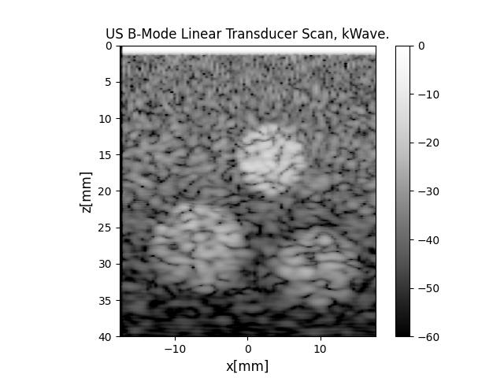

# k-Wave-python

This project is a Python interface to the [k-Wave simulation binaries](http://www.k-wave.org/download.php).

The documentation for this Python interface is compiled in a Read the Docs page [here](http://waltersimson.com/k-wave-python/)
## Installation

```bash
pip install k-wave-python
```

Currently, we are looking for beta testers on Windows.
If you would like to get involved, open an issue letting us know, or message us on the [k-Wave-python Telegram chat](https://t.me/+ILL4yGgcX0A2Y2Y6).

## Getting started


After installation, run the B-mode reconstruction example in the `examples` directory of the repository:

### Requirements

```bash
git clone https://github.com/waltsims/k-wave-python
pip install -r example_requirements.txt
python3 examples/bmode_reconstruction_example.py
```

This example file steps through the process of:
 1. Generating a simulation medium
 2. Configuring a transducer
 3. Running the simulation
 4. Reconstructing the simulation

This example expects an NVIDIA GPU by default to simulate with k-Wave.

To test the reconstruction on a machine without a GPU, set `RUN_SIMULATION` [on line 14 of `bmode_reconstruction_example.py`](https://github.com/waltsims/k-wave-python/blob/master/examples/bmode_reconstruction_example.py#L18) to `False` and the exmaple will run with pre-computed data.

## Development

If you're enjoying k-Wave-python and want to contribute, development instructions can be found [here](https://waltersimson.com/k-wave-python/development/development_environment.html).
